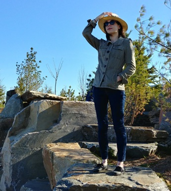

# BeeAware

## Team Member Bios

 **Sarah L. Reeser:** I am a first-year MSc student in Physical Geography at the University of Toronto. My research focuses on developing GIS models to gauge greenspace accessibility in Toronto using visibility analysis. I’m interested in exploring urban spatial relationships in general and learning how to use new GIS tools and techniques to do so. In my previous academic life, I studied medieval and early modern geography and theories of vision, so my current focus allows me to build upon my past research experience while taking my interests in new directions. My hobbies include reading, embroidery, and writing. 
 **Scarlett Rakowska:** Scarlett is a second-year MSc student in the Geography & Planning department at the University of Toronto. Her research interests involve green space and urban health. Her current research involves the urban heat island effect in Mississauga by gathering air temperature observations through mobile monitoring on a bicycle and creating a land use regression model to estimate air temperature for the entire city to better understand if air temperature is inequality distributed within marginalized communities. In her free time, Scarlett loves to cook, bake, and hike. 
 **Sana Hashim:** I am a third year undergraduate student majoring in Geographic Information Systems. My hobbies include reading, playing sports, listening to music, and creating different forms of art. 
