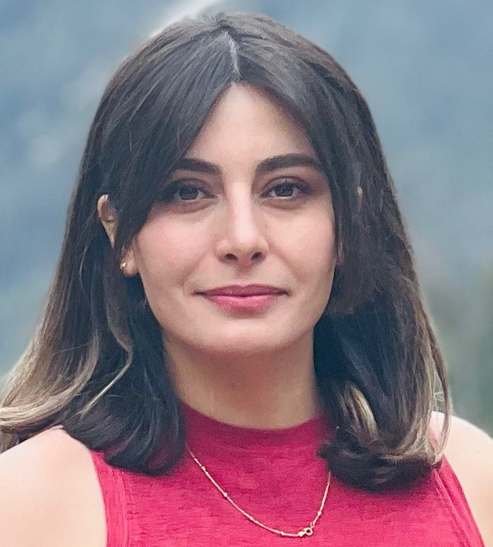
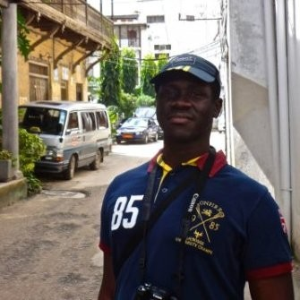
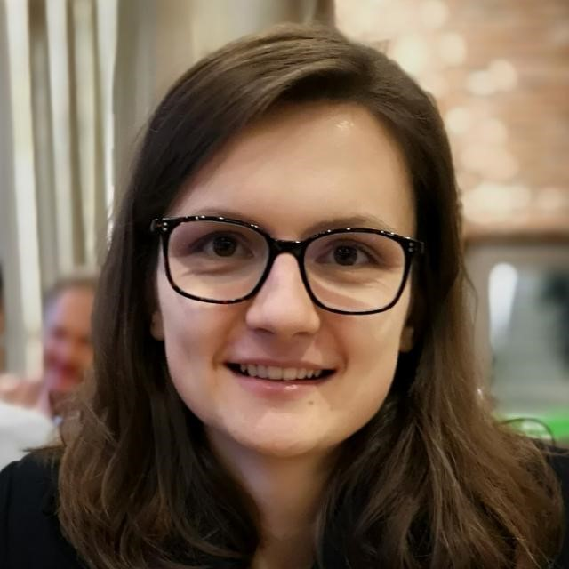

# Bow Gees

## Team Member Bios

 **Hawjin Falahatkar:** I am an MSc student in geography at the University of Calgary, and in my thesis, I identify and assess the physical features of urban public places that affect safety and equity for women in order to promote environmental gender inclusion employing ArcGIS Pro. To cover all multi-faceted aspects of gender-place relationships, I use multiple datasets. For instance, for features related to the ground surface material, I use aerial orthophotos; and for urban furniture, I use mobile LiDAR (Light Detection and Ranging) data, in both of which I automatically detect, classify, and map the features with the help of deep learning packages and models offered by Esri's ArcGIS Pro. Also, outside of my academic life, I enjoy cooking, going to the gym, watching movies, socializing, and spending time in nature! 

 **Segun Ogunleye:** I am a development practitioner, and I am presently in the Master of Geographical Information Systems (MGIS) program at the University of Calgary. My research topic is titled ‘Advancing Disability Inclusion Using Spatially Enabled Crowdsourced Data to Understand How Pedestrians Experience Barriers’. My interest is in the use of GIS techniques and models to ensure equitable decision-making in the fields of urban development planning and international development to ensure no one is left behind. I am an avid traveler and love outdoor sports. 

 **Maja Kucharczyk:** I am a PhD candidate in the Department of Geography at the University of Calgary. The overall goal of my doctoral research program is to evaluate drone-based pre- and post-disaster remote sensing as a tool to support disaster management. I enjoy the challenge of creating and communicating GIS workflows which strive to increase the efficiency and safety of disaster-related information extraction. I am currently developing an end-to-end workflow in ArcGIS Pro for automated post-storm roof damage detection and delineation using artificial intelligence (deep learning) and drone imagery. Outside of the university, I love reading, vegan cooking, and being in nature on my feet, bike, and skis. 