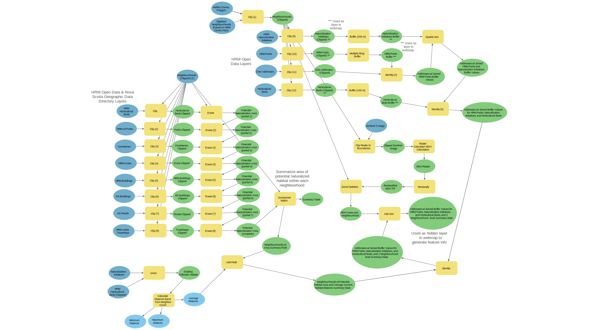

 

# [Green HFX](https://bit.ly/GreenHFX)

<body>
<!-- 
 -->
<!-- 
<strong>Team Mission Statement</strong>
  -->

## Team Mission Statement
 

We aim to empower Halifax residents to initiate naturalization activities in their own yard and help increase the total area and connectivity of pollinator habitat across Halifax. 
 
 
Halifax Regional Municipality (HRM) in Nova Scotia has achieved one of the highest urban greenness values of cities across Canada, even as its population has grown dramatically in recent years. Maintaining a high degree of biodiverse green spaces in urban centres can be challenging, yet is increasingly important as populations grow and urban centres develop. Halifax has taken an ecological approach to managing their urban landscape, prioritizing biodiversity and enhancement of natural areas through planting of native plant species. This not only improves the ecological resilience of the city, but also beautifies the urban landscape and provides opportunities for community engagement. Several naturalization initiatives have taken place across HRM, mainly working to plant native and non-invasive adapted species of plants and trees in portions of municipal parks that were previously grass turf. While initiatives like this contribute greatly to a city's overall greenness and ecological resilience, the potential in naturalizing small land patches should not be discounted.
 
 
Small-scale naturalization plays an important role in enhancing connectivity across an urban landscape, which is especially important for pollinator species and overall ecological resilience of an ecosystem. Even relatively large patches of biodiverse natural areas across an urban landscape are not meeting their full potential contribution to a landscape's overall ecological function if all that can be found between naturalized areas are equally large extents of concrete, asphalt, buildings, and grass turf. This is where small-scale naturalization plays a role, by contributing small but biodiverse habitat patches to an urban landscape with otherwise large gaps and a lack of connectivity. This important contribution to ecological resilience in an urban landscape can be effectively implemented by residents in their own yards, and provides a unique opportunity for meaningful community engagement.
 
By empowering Halifax residents to better understand their urban landscape and the role they can play in enhancing the ecological resilience of their community, we hope to further enhance HRM's urban landscape and ongoing naturalization efforts.

 

<!-- 
 -->
 
<!-- 
 -->
<!-- 
<strong> About Our App:</strong> 
  -->

## About Our App
 

Our app, Green HFX, empowers Halifax residents to effectively contribute to their city's naturalization efforts and broader ecological approach to urban landscape management. Small patches of land such as residential yards have an enormous amount of potential in terms of improving landscape connectivity and, in turn, ecological resilience. Initiating naturalization efforts in one's yard can be an intimidating prospect if they aren't already well-versed in ecological concepts like naturalization, habitat connectivity, native species planting, and ecological resilience. Our easy-to-use interface puts a large amount of relevant information directly in the hands of the user, minimizing the amount of research required before someone feels equipped to start their own naturalization project at home. The user simply enters their address and is presented with location-specific information that contextualizes their yard within the broader urban landscape and clearly explains the potential added value of a naturalization project at that location. Explanations of relevant ecological concepts, effective visualizations of the current distribution and connectivity of HRM's naturalized areas, and organized links to additional resources can all be found in our app, effectively facilitating community engagement on an issue that is already at the forefront of Halifax's agenda. Our app also provides a template for potentially larger-scale community engagement on the issue of ecological urban landscape.

 

 

 

## Geoprocessing 
 

1. Data relevant to our urban ecology project was collected from the listed open data sources.

2. The boundaries of the five  major neighbourhoods in the city of Halifax, the South End and Downtown Halifax, the North End of Halifax, Fairview and the WestEnd, North and Downtown Dartmouth, and Southdale and Woodside were delineated roughly using the Halifax [centre plan](https://cdn.halifax.ca/sites/default/files/documents/about-the-city/regional-community-planning/smps_rc_map1-urbanstructure_22aug2022_1.pdf) as a guide. The county polygons were used to clip the coast and make the boundaries more accurate.

3.  The naturalization initiatives, parks, municipal gardens, and civic addresses layers were clipped to the new extent for the HRM urban core. A 150 m buffer was created for the municipal gardens layer. A 200 m buffer was created for the initiatives layers, and a multiple ring buffer (50, 100, and 200 m) was created for the parks layer. These buffer layers were joined to the civic addresses feature layer using identity/spatial join.

4. Eight layers from HRM Open Data and Nova Scotia Geographic Data Directory were clipped to our defined extent. Then each was removed from that extent polygon feature layer using the erase tool, leaving a polygon feature layer representing all potential naturalization areas.The total areas for potential naturalization were then summarized and grouped by neighbourhood using the summarize within tool and added as a field to the civic addresses feature layer. 
	
5. Sentinel-2 imagery was acquired to perform an NDVI analysis on the five neighbourhoods. This was achieved by clipping the raster image to the neighbourhoods boundary file. An NDVI calculation was performed on the clipped raster image. The mean results were then extracted through zonal statistics tool and exported to a table that will later be joined to the Addresses w/joinedHRM Parks and naturalization initiatives buffer values feature layer.  

    

6. The naturalization initiatives and HRM horticultural beds layers, clipped to the defined extent, were merged using the union tool to generate a layer representing all existing pollinator habitat. This layer was input to the calculate distance band from neighbour count tool, and average distance was then added as a field to the civic addresses feature layer. 

7. The identity tool was used to merge all buffer-related fields and neighbourhood-level summary statistic fields into a single civic addresses feature layer.

 
 

 

 

 <b>Figure 1. This Model Builder diagram</b> shows the complete workflow and geoprocessing that was done to arrive to the final product displayed in the Experience Builder. 
 
 

## Data Sources

 

| Layers      | Sources     | Description |
| ----------- | ----------- | ----------- |
| Municipal Garden | [HRM Open Data](https://catalogue-hrm.opendata.arcgis.com/datasets/3f92650723014afbadaec6291a5af817_0/explore?location=44.708254%2C-63.580559%2C12.15) | Polygon representation of horticultural beds        | 
| Naturalization Initiatives   | [HRM Open Data](https://catalogue-hrm.opendata.arcgis.com/datasets/191ac3dc7ec54e2dad68f7770a838aed_0/explore?location=44.674046%2C-63.609991%2C12.00)        | Point representations of biodiverse landscapes initiatives        | 
| Municipal Parks  | [HRM Open Data](https://catalogue-hrm.opendata.arcgis.com/datasets/3df29a3d088a42d890f11d027ea1c0be_0/explore?location=44.795322%2C-63.163394%2C10.55)        | Polygon representation of HRM owned and maintained parks        | 
| NDVI  | [Copernicus](https://scihub.copernicus.eu/)       | Derived from Sentinel 2         | 
|Address   |[HRM Open Data](https://catalogue-hrm.opendata.arcgis.com/datasets/2bc8323870fe44eab50630404713be6a_0/explore?location=44.854682%2C-63.162493%2C10.16)         | Points representing the geographic location of civic addresses        | 
|Nearness to naturalization initiative |[HRM Open Data](https://catalogue-hrm.opendata.arcgis.com/datasets/2bc8323870fe44eab50630404713be6a_0/explore?location=44.854682%2C-63.162493%2C10.16)         | Buffer layer that displays proximity at  200m | 
|Nearness to garden   |[HRM Open Data](https://catalogue-hrm.opendata.arcgis.com/datasets/3f92650723014afbadaec6291a5af817_0/explore?location=44.708254%2C-63.580559%2C12.15)          | Buffer layer that displays proximity at 150 m      | 
|Nearness to park   |[HRM Open Data](https://catalogue-hrm.opendata.arcgis.com/datasets/3df29a3d088a42d890f11d027ea1c0be_0/explore?location=44.795322%2C-63.163394%2C10.55)          | Buffer layer that displays proximity at 50 m, 100 m, and 200 m      | 

 

<b>Table 1. A table that includes all the layers that are used in our map.</b> The addresses layer was used as a master file for all the geoprocessing information to compile the pop-up information for each civic address which included the values.

 
 
 
 

| Data      | Sources     | Description |
| ----------- | ----------- | ----------- |
| Grass inventory   | [HRM Open Data](https://catalogue-hrm.opendata.arcgis.com/datasets/65f2b47c810a4be4a7ae661d53da6490_0/explore?location=44.804527%2C-63.153047%2C12.00)        | Polygon representation of grass areas        | 
| Buildings   | [HRM Open Data](https://catalogue-hrm.opendata.arcgis.com/maps/1f73c9ad861a4fd9998c097d3544c08e)        | feature data collection of building related datasets        |  
| Municipal cemeteries mapping      | [HRM Open Data](https://catalogue-hrm.opendata.arcgis.com/maps/72cda3bcf78c4a8dade14da2894c3295)       |Polygon representation of municipal cemetery boundaries and locations         |
| NS highway design guideline| [Public Works](https://novascotia.ca/tran/highways/standarddrawings.asp)| Used to calculate width of roads for creation of "potential habitat" layer       |
| Roads   |[NS Data Directory](https://nsgi.novascotia.ca/gdd/)        | Addressed road geometry        |  
| Buildings   |[NS Data Directory](https://nsgi.novascotia.ca/gdd/)        | Buildings Layer     
| Street Centrelines|[HRM Open Data](https://catalogue-hrm.opendata.arcgis.com/datasets/560fec412dd044b08ae52a8575a215d4_0/explore?location=44.855813%2C-63.136348%2C10.11)        | Single line representation of every street in HRM   
| Active Travelways|[HRM Open Data](https://catalogue-hrm.opendata.arcgis.com/datasets/a3631c7664ef4ecb93afb1ea4c12022b_0/explore?location=44.747513%2C-63.293762%2C10.50)        | Linear representation of assets 
| Sentinel Satellite Image|[Copernicus](https://scihub.copernicus.eu/)       | A multispectral Sentinel 2B image from July 2022 
   

 

<b>Table 2. A collection of all other data sources that were utilized in geoprocessing steps.</b>
 

 

## <b>[Click here to start using our App!](https://bit.ly/GreenHFX)</b>

</body>

 
 

