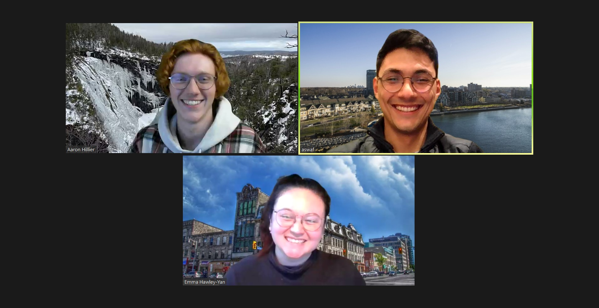

# COGS From Away

## Team Photo

## Team Member Bios

**Ali Al Wafi:** I am an ECCE Student Associate who is currently working remotely on a GIS graduate certificate from the Centre of Geographic Sciences (NSCC) in Nova Scotia. I completed a Bachelor of Science in Biology, GIS, and Psychology from the University of Toronto Mississauga. My previous work experience includes several years of working in various research greenhouses in Ontario. I have also had the privilege of founding a local wedding entertainment business. Outside of work and studies, I have a passion for maps, plants, and nautical activities. Paddling and sailing the Great Lakes is my jam! Whenever I've got some downtime, you'll catch me out there on the waves, soaking up the sun and enjoying the thrill of it all.

**Emma Hawley-Yan:** I am a student in the COGS GIS graduate certificate program, living in Guelph, Ontario. I completed my undergraduate degree in 2018, obtaining a Joint Honours Bachelor of Environmental Studies in Biology & Environment and Resource Sustainability, as well as a Diploma in Ecological Restoration and Rehabilitation from the University of Waterloo. I am passionate about socio-environmental sustainability and community-driven stewardship, and am  excited to apply the incredible technical knowledge I'm gaining at COGS to the environmental and social issues I care most about. In the past few years, I've worked as an outdoor education specialist, a species at risk biologist, an education & outreach coordinator in the environmental non-profit sector, and (detouring briefly) as co-founder, owner and operator of a small take-out restaurant in Toronto. In my spare time, I most enjoy going on long hikes, backcountry canoeing, making art, cooking delicious food, and relaxing at home with my partner, many house plants, and three pet bunnies.

**Aaron Hillier:** I am an online student in the GIS graduate certificate program at COGS, currently living in Corner Brook on the west coast of Newfoundland. I also hold a Bachelor of Arts degree in geography and French from Saint Mary’s University in Halifax, Nova Scotia. My education has helped me build a solid foundation of geographic theory in areas such as geodesy, cartography, remote sensing, urban planning, and environmental management. My current studies at COGS have been the “icing on the cake” so to speak, as I have been able to apply my theoretical knowledge in a very practical and hands-on way. In my free time, I love to play music, film and edit videos, and paint. I also love anything to do with the outdoors, such as camping, hiking, skiing, hunting, and fishing.