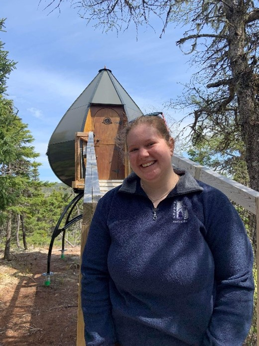
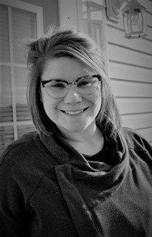
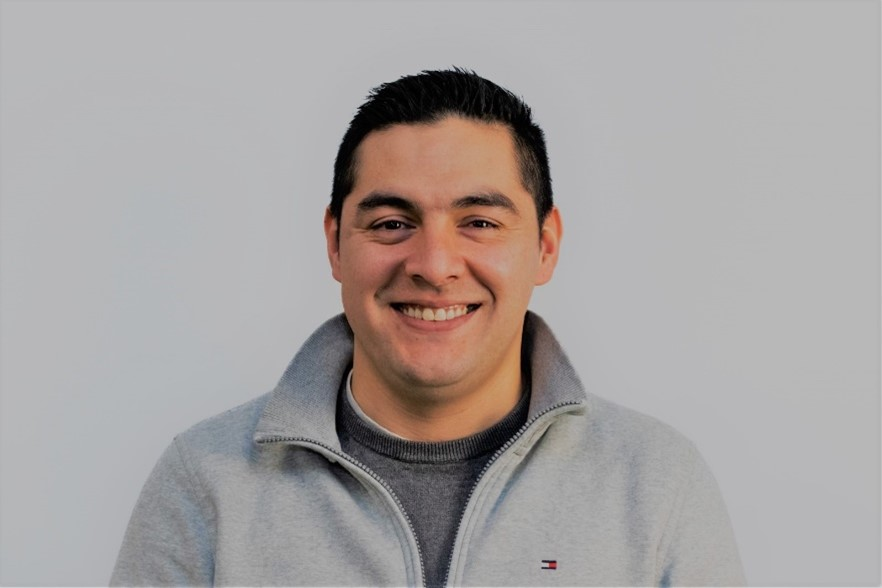

**Team: GIStice League**

Team Bios

 

**Molly Ingenmey:** Molly Ingenmey is a current student at the Centre of Geographic Sciences, enrolled in the Geographic Information Systems Graduate Certificate program. Molly has a Joint Bachelor of Arts in Archaeology and Geography (2022) from Memorial University in Newfoundland. Her passion with GIS began in university, when she got a job in the Maps Room at Queen Elizabeth II Library creating and updating ESRI StoryMaps. With a combined interest in past and present human-environment interactions, she is excited to combine her skills in GIS, Archaeology and Geography!  

 

**Jessica Grande:** Jessica Grande is currently enrolled in the Geographic Information Systems Graduate Certificate program at the Centre of Geographic Sciences. Living in Antigonish, NS with her family, she graduated from NSCC in the Natural Resources Environmental Technician program in 2021, and it was there she discovered her interest in GIS! Being able to apply the knowledge from both programs to the App Challenge and stepping out of her comfort zone has been a rewarding experience.  

 

**Gabriel Herrera:** As a graduate student in the Geographic Information Systems (GIS) program at the Centre of Geographic Sciences (COGS) – NSCC with a background in environmental engineering, I am passionate about using GIS tools and models to analyze and mitigate the environmental impacts of human activities. My skills include geospatial data analysis, remote sensing, spatial statistics, and geodatabase management, and I have experience developing custom GIS applications using Python and different tools provided by Esri.

My interests lie in using GIS to support evidence-based decision-making in areas such as land use planning, natural resource management, and environmental policy, focusing on modelling the socio-economic and environmental impacts of proposed development projects. I am committed to continuing my education and practical experience to build my geomatics and environmental sustainability expertise and contribute to a more sustainable future for our planet.  
