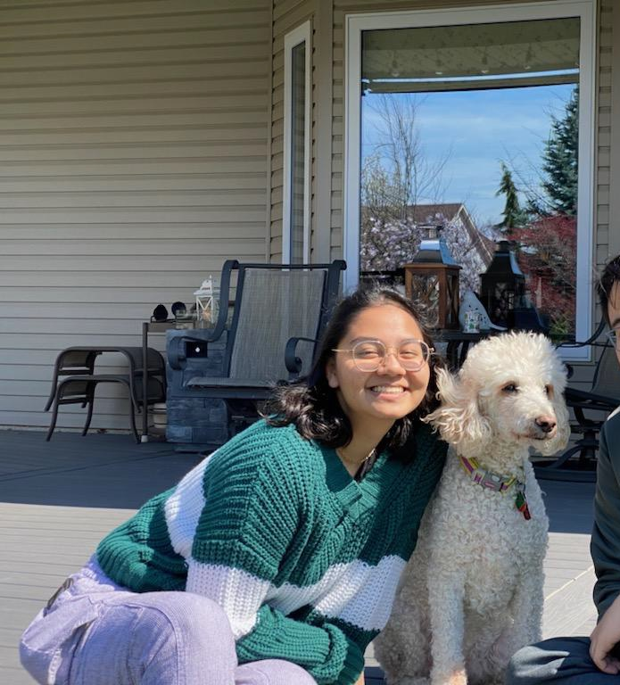
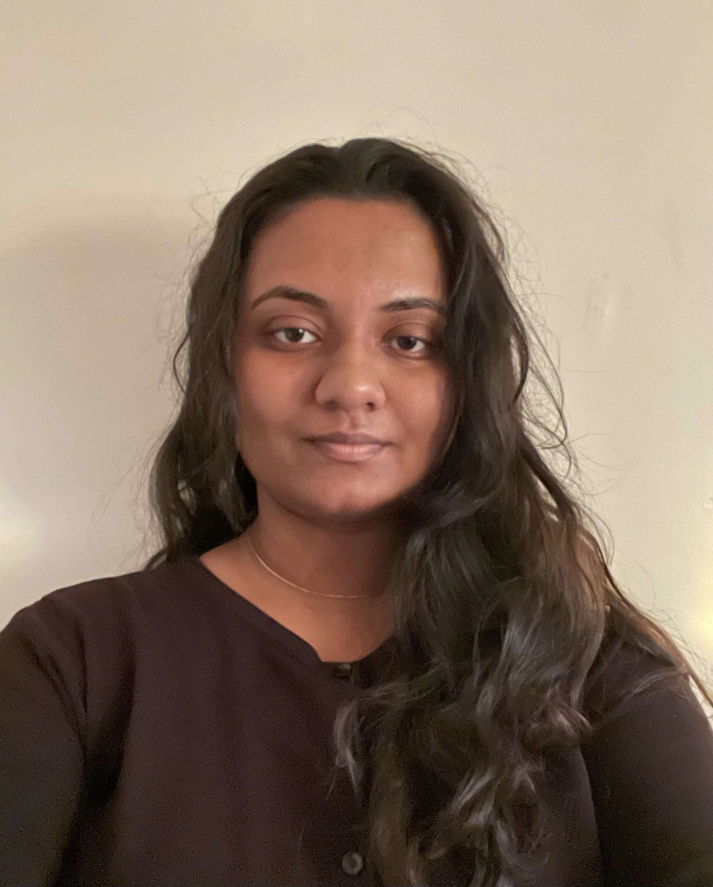
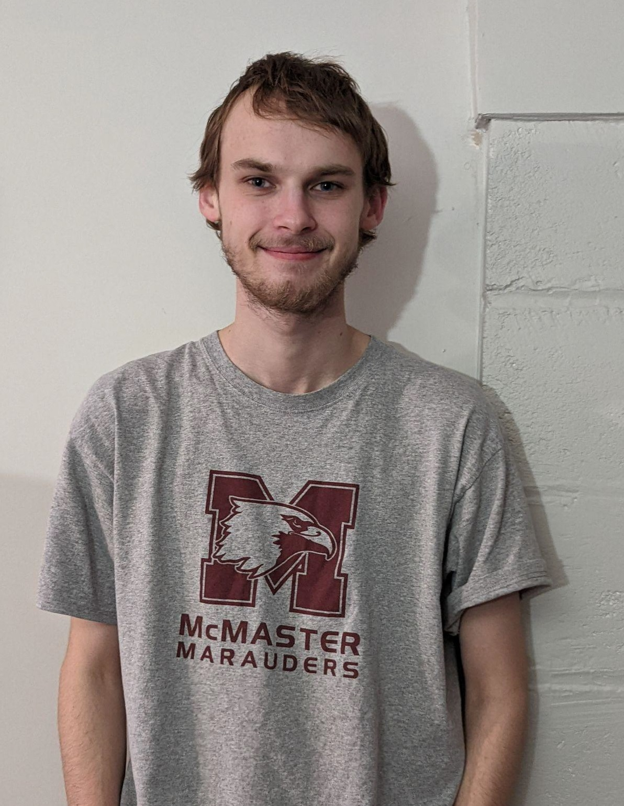

# GIgniteS

## Team Member Bios

 

***Amy Hopman:*** I am currently a fourth year Biodiversity & Environmental Sciences student focusing in GIS and ecology, and I am starting work with the Canadian Hydrographic Service this Summer. My senior thesis studies how incorporation of social variables differs from Canada’s weather-based Fire Weather Index. While I’m not working away in the lab, I can usually be found crocheting, knitting, or playing with my pet frogs and dogs. 

 

***Krisiga Krishnarajah:*** Currently, I am a fourth year Environmental Sciences co-op student pursuing a certificate in GIS. My senior thesis looks at the patterns and predictors of emergency department visits in Hamilton, Ontario, using data from Code Red, a study that observed disparities in the determinants of health and health status that exists in the city. During my free time, you can find me reading or playing with my cat, Kiki. 

 

***Stuart Jones:*** I am a fourth year Environment & Society and Political Science student pursuing a concurrent GIS certificate. I find the study of how humans use and interact with space to be a fascinating subject and am interested in exploring how GIS can be used to analyse and visualise this relationship. In my free time I enjoy long distance running, playing Football Manager, and watching hockey. 
