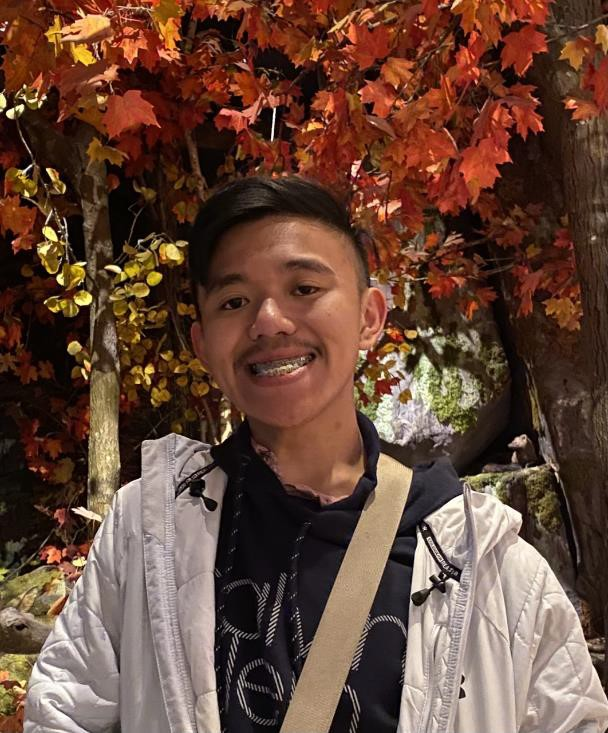
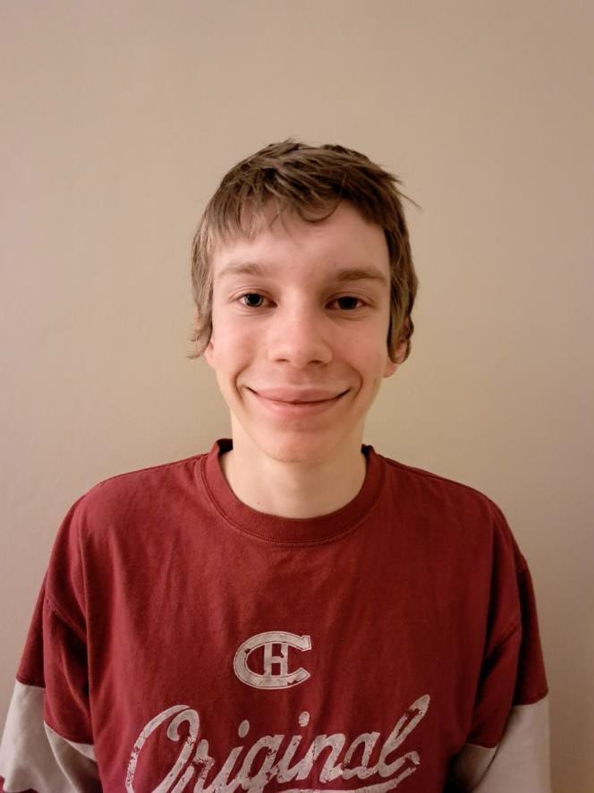
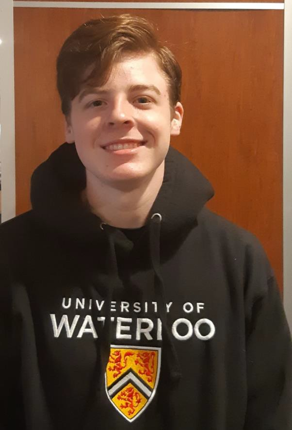

# Geese Against Mercator

## Team Member Bios

 **Joseph Nicolas**: I'm a fourth-year Geomatics student at the University of Waterloo along with a double minor in computing and economics.  Being in this program allowed me to combine both my passions in geography and computer science, making it an incredibly fulfilling field to study and work in. My most recent experience includes working as a Geospatial Analyst which has been a fantastic opportunity to apply my technical expertise in a real-world setting. I was able to use the skills I learned to manage and update map layers, create detailed and accurate visualizations of spatial data, and utilizing geospatial technologies to automate data analysis and process workflows. In my free time, I enjoy reading books and playing video games, as well as spending quality time with my family and friends. 

 **Micah Colman**: I'm a first-year Geomatics student at the University of Waterloo. I have been involved in various geography competitions at a national level during high school, events which furthered my passion for the field of geography. I am interested in how various natural phenomena can impact human systems and the relationships between human and environmental forces. In my free time, I enjoy playing video games and participating in trivia events with friends. 

 **Matthew Woodward**: I am a first-year student at the University of Waterloo majoring in Geography and Environmental Management. I was a gold medalist at the International Geography Olympiad, placing eighteenth in the world in 2022. I am interested in natural disasters and using GIS to address their impacts. This interest was reflected in my work for the Northern Tornadoes Project last summer. In my free time, I enjoy following hockey and playing trivia. 