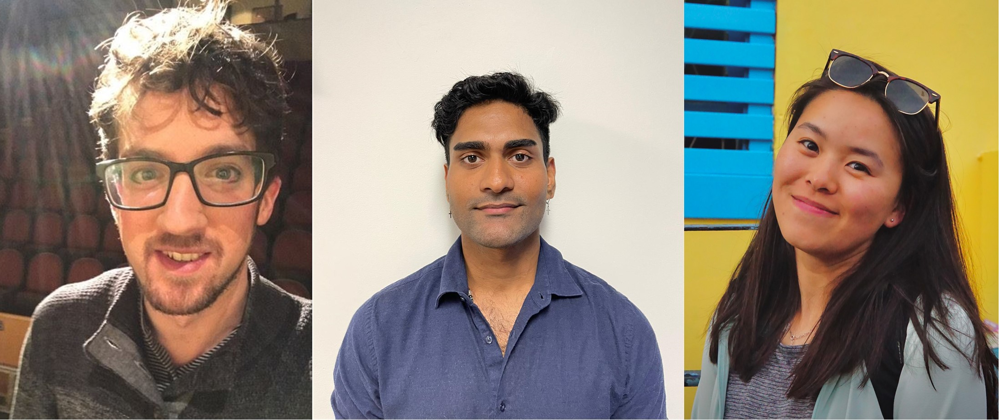

## Team Members

Left to right: François d'Entremont, Mohit Francis, Cindy Lu

**François d'Entremont:** Hi! I'm a geospatial data enthusiast, and my interests in math, programming, machine learning, spatial analysis, and chess led me to pursue a graduate certificate in Geospatial Data Analytics. One of the coolest projects I'm currently working on is classifying pottery shards from the Levant using machine learning models. It's a fascinating challenge that allows me to apply my spatial analysis and machine learning skills to real-world problems. As a curious and passionate learner, I'm always eager to take on new challenges and explore new opportunities in the exciting world of geospatial analysis. Whether it's using data to make informed decisions or developing innovative solutions to complex problems, I'm ready for whatever comes my way. 

When I'm not busy analyzing data, you'll likely find me watching hockey games, cheering for my favorite teams, and enjoying all the action on the ice!

**Mohit Francis:** Hello! My interests in human health, culture, and impacts (especially on the environment) led me to complete a Bachelor of Science in Human Biology and Evolutionary Anthropology, and a Certificate in Bioarchaeology from the University of Toronto. During my undergraduate studies, I learned of spatial analysis and the many methods of applying geographic information systems (GIS) technology. As someone who has always enjoyed analysing and working with big data, I wanted to learn more in the hopes of eventually working in a sector aligned with my interests. This led me to the Centre of Geographic Sciences (COGS), where I'm currently enrolled in the GIS graduate certificate program for the 2022-2023 academic year.

The themes of this year's ECCE App Challenge - Conservation and Protected Areas or Urban Ecology - dovetail perfectly with my interests. On the academic side, for my term-long project at COGS, I am researching coastal erosion on the North Shore of Nova Scotia caused by extreme weather events. On the personal side, one of my most memorable experiences was being part of the volunteer tree planting and stewardship program organised by the Parks, Forestry, and Recreation Department of the City of Toronto. Planting native tree species and removing invasive species is a common ecological management technique in urban areas, of course. Outside of my studies and work, I enjoy watching and playing football (*incorrectly* called 'soccer'), and I hope to see Arsenal lift the title (knock on wood!) this May! 

**Cindy Lu:** Hello! My GIS journey began with a curiosity for the world around me and a desire to understand how different factors interact and influence each other. While working at a conservation organization in beautiful British Columbia, I discovered the power of GIS to bridge knowledge gaps across time and space. With its versatility and compatibility with different types of data and industries, GIS quickly became a passion of mine. Currently, I am studying in the Geospatial Data Analytics program at COGS, building on my previous education with a Bachelor of Arts in Environment from McGill University. When I'm not glued to my computer screen, you can often find me exploring new hiking trails, checking out cozy local shops, or venturing off to far-off lands and waters. I hope our app will encourage you to learn a little more about the diversity of Canadian ecosystems and explore ways to protect and conserve the place we call home.