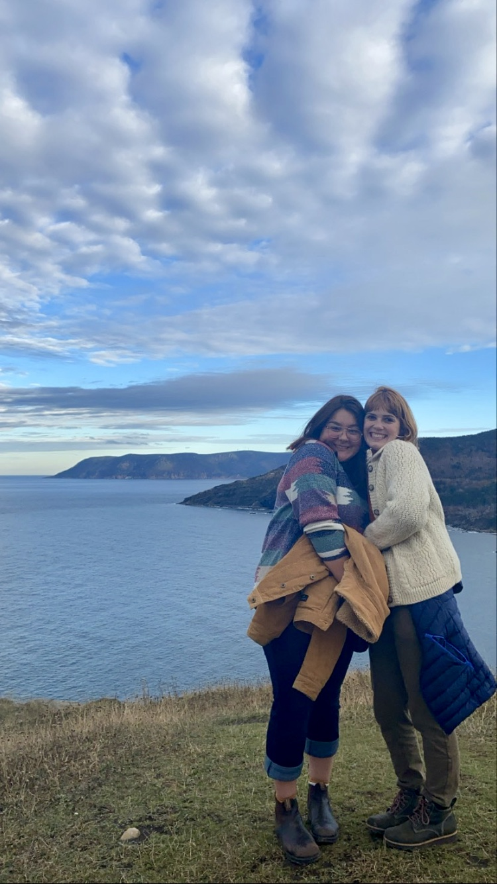

# Geospatial Queens
## Team Members

Left: Emma Taniguchi, Right: Catherine Brenan

**Catherine Brenan:** My name is Catherine Brenan (she/her), and I am a Dalhousie University undergraduate student completing a Combined Honours in Environmental Science and Chemistry with a Certificate in GIS. My research interests include using spatial modelling to understand carbon stock on the seafloor. I am excited about the app challenge since it will be a great experience to learn more about the different Esri tools and how they can be applied to urban ecology and conservation.

**Emma Taniguchi:** Hi! My name is Emma Taniguchi, and I am a fifth-year undergraduate student completing a BSc Honours in Environmental Science, a minor in Oceanography, and a certificate in GIS at Dalhousie University. My honours research focused on the lens of environmental injustice in the country as we move forward in addressing the climate crisis. I used ArcGIS Pro to geospatially analyze the relationship between hydroelectric dam placement and Indigenous and other marginalized communities in Canada. With my research endeavours, I hope to use geospatial tools to make the world a fairer and more equitable place while addressing challenges related to climate change and environmental degradation. 
