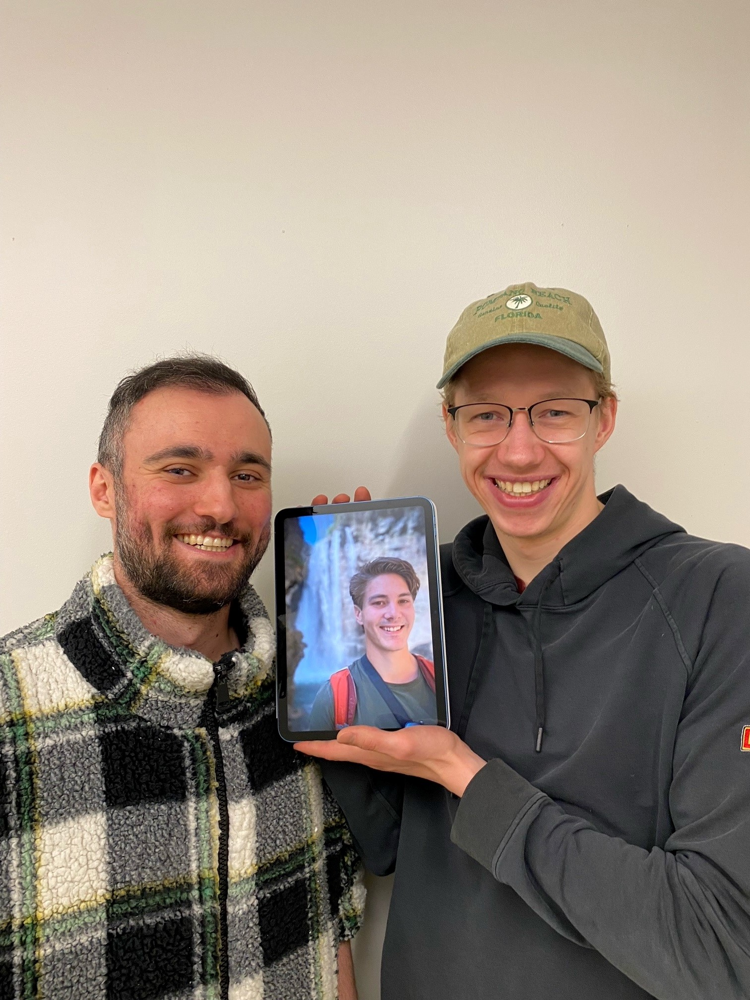

# Goose Guards
## Team Members

Left to right: Milad Malekzadeh, Steffen Shaigec, Matthew Ketchin

**Matthew Ketchin:**
Matthew is a first-year Master's student in the department of Geography and Environment at the University of Western Ontario and is a member of the Geospatial Analysis Lab. He graduated from the University of Calgary with a degree in Ecology and a minor in Geography. His research interests center around the spatial and temporal analysis of big data in environmental health applications. 

**Milad Malekzadeh:**
Milad is a Ph.D. candidate in GIS (Geographic Information System) at the Department of Geography and Environment, University of Western Ontario, Canada. He is currently working on his thesis on Context-Aware Human Mobility Analysis Using Multi-Source Data and Machine Learning. His research interests include geospatial analysis, artificial intelligence and machine learning, network analysis, big data, movement analysis, and context-aware systems. Milad is a member of The Canadian Association of Geographers (CAG) and The American Association of Geographers (AAG). Furthermore, he has chaired the International Student Committee in the Department of Geography and Environment at Western University and is a member of the Integrated Transportation Community Advisory Committee in the City of London, Ontario. Milad is also a member of Reforest London, a non-profit organization to enhance environmental and human health in the Forest City.

**Steffen Shaigec:**
Steffen is a second-year MSc student in the Department of Geography and Environment. He is developing a mobile, ground-based, high-resolution remote sensing system using Light Detection and Ranging (LiDAR) technology to document the detailed urban built and vegetated surface structure. Steffen is a lead member of Western's CubeSat Science team, which is designing a small remote-sensing satellite for launch from the International Space Station. Steffen's interests include all things related to sustainability, space, and entrepreneurship within Low Earth orbit.
