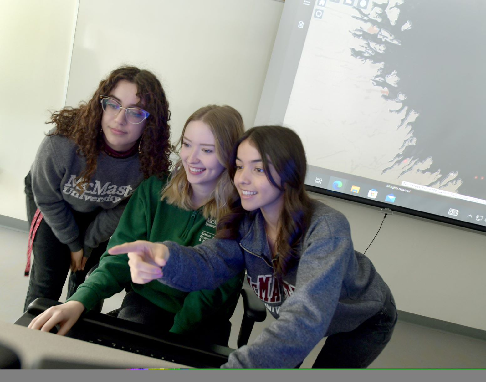

# McLakers
## Team Members

Left to right: Angie Abi Daoud, Olivia Maddigan, Madina Sulaymonova

**Madinakhon (Madina) Sulaymonova:** I am currently an ECCE Student Associate for McMaster and in my final year of Honours Environmental Sciences Co-op. I am fully accredited to attain a Certified GIS Professional (GISP). My interest in GIS revolves around my passion for  pidemiology. My undergraduate senior thesis focussed on PM2.5 exposure and inhalation dose along varying routes in Hamilton, Ontario. I have worked as a GIS student for Bruce Power and McMaster’s Utilities Department. My hobbies include drinking bubble tea while listening to true crime podcasts, playing APEX Legends, and hot yoga.

**Angie Abi Daoud:** I am a PhD candidate with the Quantitative Sedimentology Lab at McMaster University, where I also earned a BSc in Earth and Environmental Sciences and a GIS Certificate. My project involves studying paleoenvironments using stratigraphy, geochemistry, ethnogeology, and micropaleontology in the Northwest Territories. Outside of academics I enjoy fossil hunting, crocheting, hiking, and taking care of my farm in Stardew Valley.

**Olivia Maddigan:** I am in my final year of Geography and Environmental Science Co-Op at McMaster University. My senior thesis project focused on respiratory health determinants in Hamilton, Ontario. I am now working at Environment and Climate Change Canada within the Water Quality Monitoring and Surveillance Division for the Great Lakes.