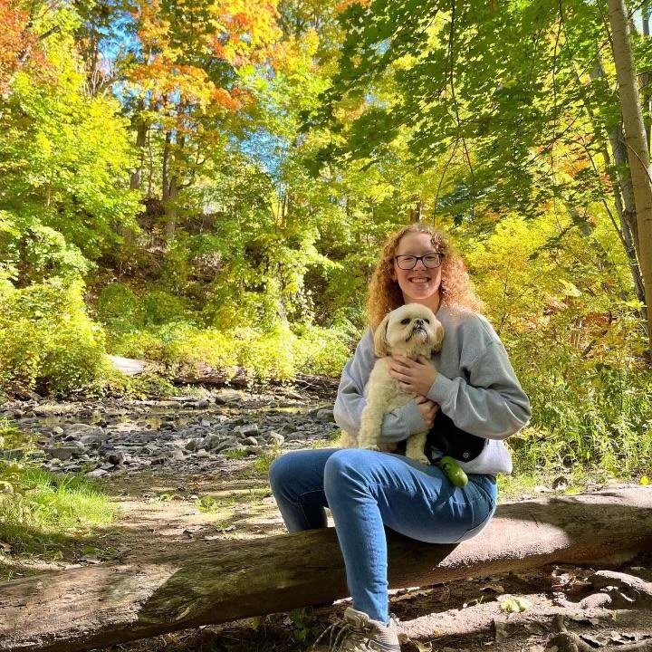
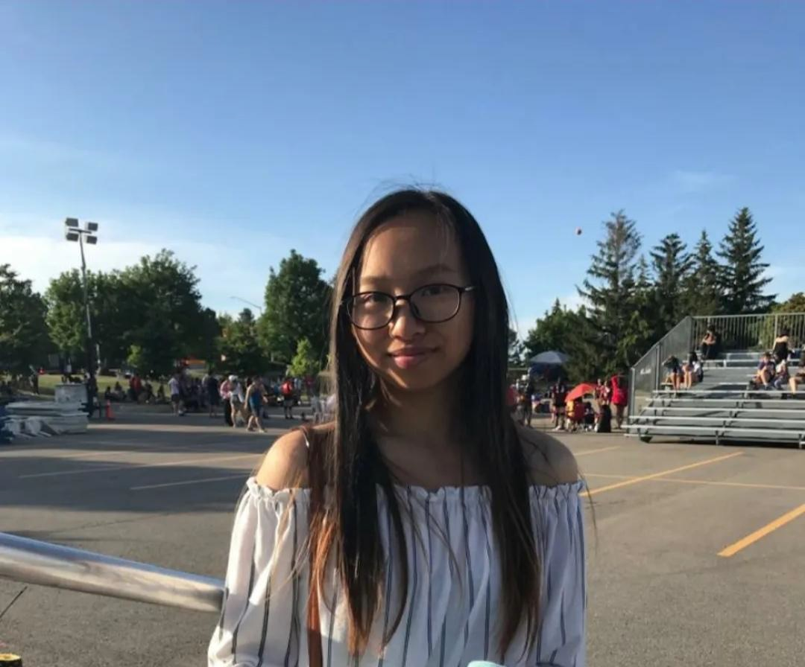
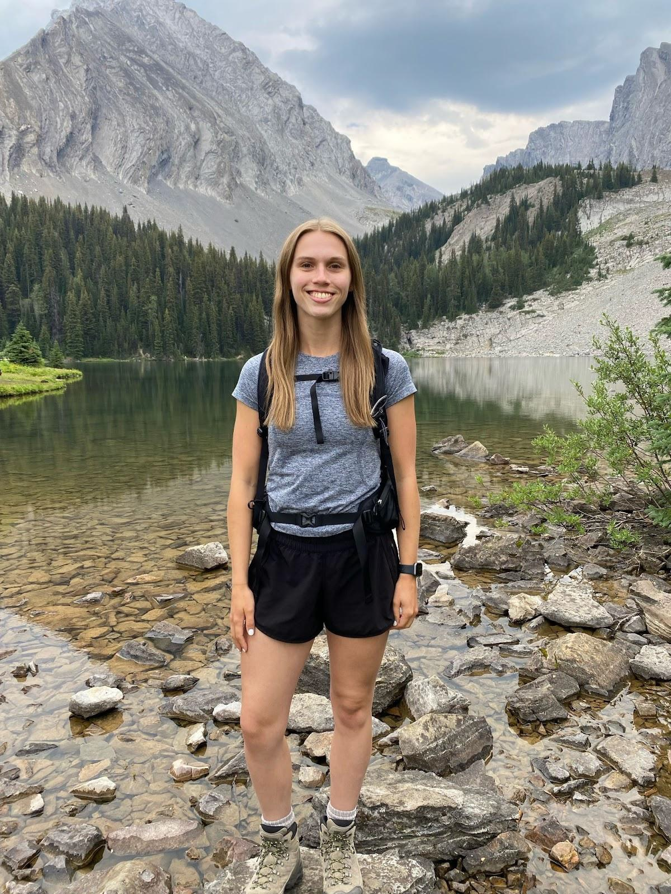

# Mercator Gladiators

## Team Member Bios

 **Leah Smith:** I am a third year student in the Honours Integrated Science program and a new ECCE student associate. I’m concentrating in earth and environmental science while pursuing a concurrent certificate in GIS. My academic interests are related to the applications of GIS in geological and historical analyses. I am currently working on an independent project where I am using historical aerial imagery to conduct a change detection analysis of the main McMaster University campus in Hamilton, Ontario, displaying how the campus and its buildings have evolved over time. Beyond academia, I love immersing myself in all things music, from playing ukulele in my bedroom to performing in the MacSci Musical. 

 **Kaitlyn Ng:** I am a fourth year Honours Earth and Environmental Science student pursuing a certificate in GIS. I took an interest in GIS in second year as a way to take a break from chemistry, and gained a passion for the multitude of analyzes that GIS is capable of. I hope to be able to apply my knowledge towards using GIS to visualize water contamination and pollutants. In my spare time, I like playing piano, squishing my dog, and reading sci-fi novels. 

 **Elysia Feaver:** I am a fourth-year Honours Earth and Environmental Sciences student and ECCE Student Associate pursuing a Concurrent Certificate in GIS. My passion lies in applying GIS to geology, and I am always interested in learning how spatial analysis can enhance our understanding of the earth. Outside of academia, I am an active member and treasurer of McMaster’s cheerleading team. In my free time, I love to get outside and explore nature, whether it be through hiking, kayaking, or just staying active. 