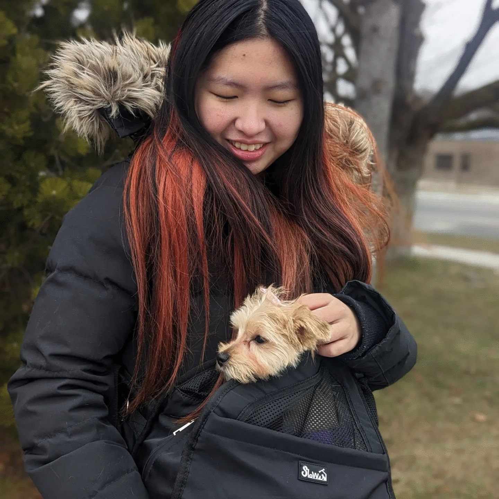
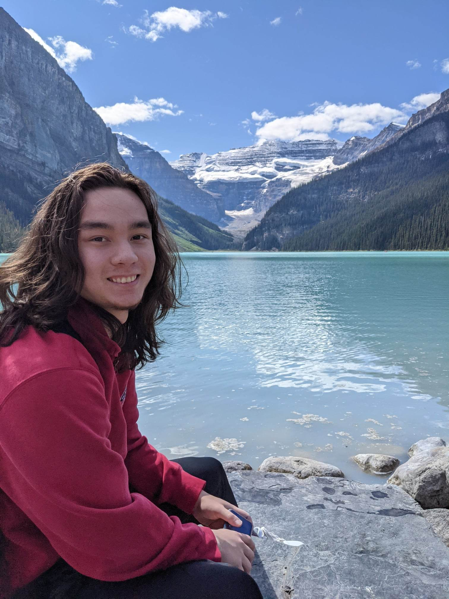
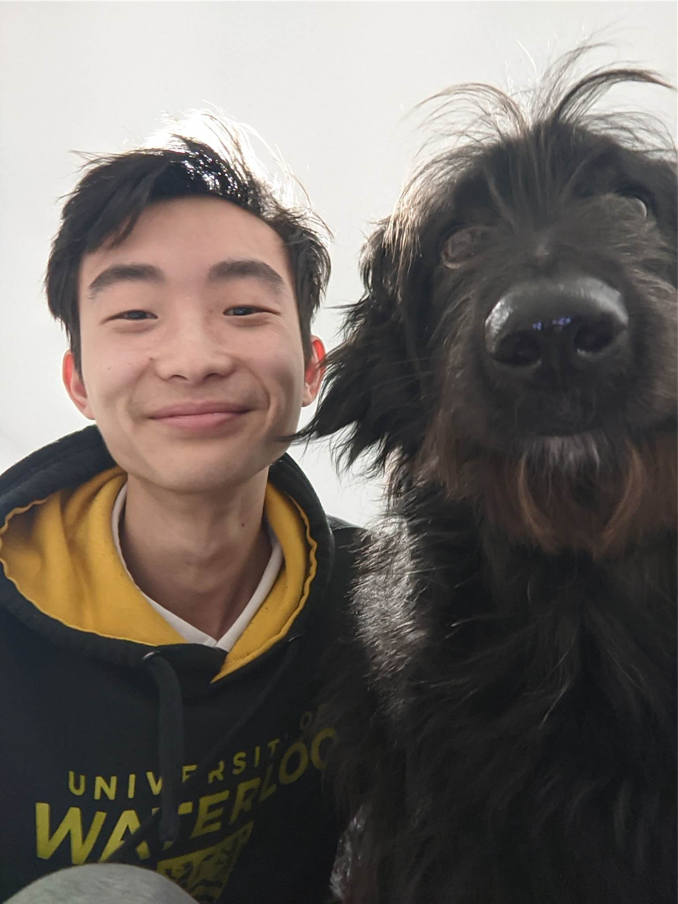
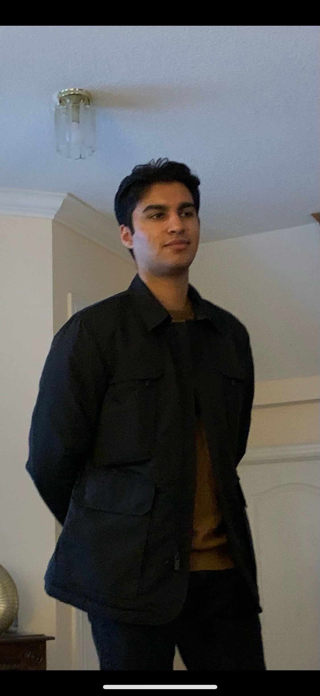

# Passing Geomatics

## Team Member Bios

 **Belle Tuen**: Hi everyone my name is Belle Tuen and in my pocket is my new puppy Uta, I’m in 4B Geomatics here at the university of Waterloo. My interests are in playing badminton, video games and hanging out with friends. I’m really excited to be part of the app challenge this year, as I finish up my degree.  

 **Noah Cameron**: Hello everyone my name is Noah Cameron, I’m also in 4B Geomatics here at the university of Waterloo. I love playing recreational hockey and spending time with my friends. This is my first time participating in the App challenge and I’m looking forward to using all the GIS skills I’ve learned throughout my undergraduate.  

 **Victor Yan**: Hello everyone my name is Victor Yan and beside me is my best friend Barkley. I’m in my 4B of Geomatics at the university of waterloo as well. I love to play hockey and video games such as TFT & league of legends. I’m looking forward to being a part of the ESRI challenge this year, where we can all experiment and have fun with GIS.  

 **Gagandeep Singh**: Hi everyone my name is Gagandeep and I just go by Deep. Like everyone I’m in my 4B term of Geomatics here at the university of Waterloo. I’m a big hockey fanatic as well and generally just love studying GIS, particularly in the case study of Forest Fires. It’s a pleasure to be a part of the ESRI challenge this year.  