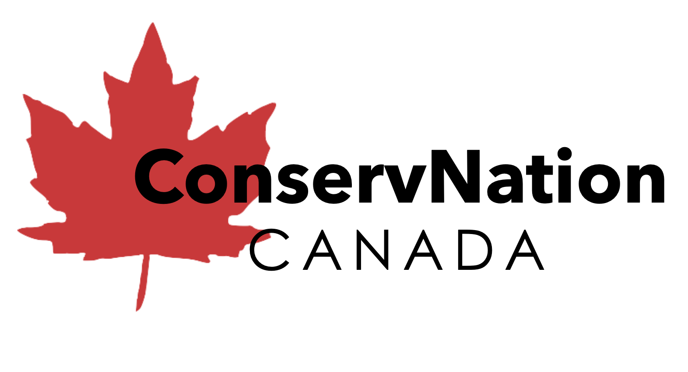

  
# Introducing: ConservNation!

From aquamarine-coloured lakes, to crucial wetlands, to forests and grasslands full of diverse species of wildlife, Canada is home to some of the greatest, most diverse natural beauty on the planet. We take protecting this beauty seriously; more than 12% of Canada's terrestrial area is considered protected. Unfortunately, while the 'protected' designation does much good, it also does not solve many of the greater environmental and human challenges, which affect the nation as a whole. Canada and its natural beauty -- protected or not -- faces significant risk and challenges associated with climate change. It's warming at twice the rate of the global average, and resource extraction as well as burgeoning urban development continue to put many protected and unprotected areas, and all of the important wildlife associated with them, at risk of habitat loss, irreversible temperature changes, and air quality issues.   

**This is where ConservNation comes in.**    

Conserving areas already designated as protected, and finding new areas in need of swift protection, does not start without awareness. This includes exploring some of Canada's existing natural wonders, as well as learning more about your favourite parks and the species-at-risk that they contain. It also means analyzing a ton of data on climate change, anthropogenic (man-made) factors, and land-use patterns to explore the susceptibility and risk posed to existing protected areas, as well as discovering at-risk areas and wildlife that are largely unprotected currently. Fortunately, _ConservNation_ does this data analysis for you. We have assembled over 30 climate-related variables, from three different climate change scenarios for all of Canada, several anthropogenic variables (including night-lighting, population density, and distance to urban areas), and used them to inform susceptibility indices. You can explore which protected areas and wildlife are most susceptible to this issues, based on our analysis; however, if you want to be the analyst yourself, Conservnation allows you to create your own susceptibility models, prioritizing variables you believe matter, and seeing areas in Canada in need of further protection.  

## **Our Mission**
   Our mission is three-fold. First, is to educate the public about the over 139.9 million hectares of protected or conserved lands of Canada that make up 12% of its land area. Despite these protections, however, these rich landscapes face the combined threats of encroaching human activities and a rapidly changing climate. Our subsequent goals thereby are to identify Canada's most threatened protected areas, and project opportunities for future conservation. ConservNation works to serve as a powerfully informative, dynamically analytical, and resource-full web app with all the information and tools you need to develop a greater understanding of Canada's protected areas, areas that should be protected, and the impacts of climate change and human settlement on them. 

## **About the App**

   ConservNation focuses on Canada's protected and conserved areas, as defined by the Canadian Protected and Conserved Areas Database (CPCAD) (Environment and Climate Change Canada, 2022). It goes beyond the surface to provide the user with a plethora of information on the most notable of these, Canada's National and Provincial Parks. The app employs Canada's publicly available geographic data to assess the risks these areas face from the 'human footprint' and goes a step further to put the user in control of analysis to map human and projected climate impacts across the country. Looking to the future, ConservNation can aid in guiding management decisions on new lands to protect by providing spatial context on the vulnerability and ecological significance of the vast Canadian landscape. This is guided in part by biodiversity data partially attributable to citizen science, for which there are resources for the user to get involved in. 
   
## **How to use the App**

### Homescreen
  Get an overview of Canada's protected and conserved areas, our mission and use the links to head straight to another page that catches your eye!

### Canada's National Parks

  Explore Canada's National Parks by the dozen and Provincial/Territorial Parks by the 100s by search, map navigation or via one of our provided bookmarks. Click on a park to be greeted with useful information such as their year of establishment, size and nearest major city if you are thinking about a visit. Scroll further in the pop-up window to learn about the SAR that call the park home as well as get an idea of the kind of landscape it occupies with a handy graph of Landsat-8 derived land cover classifications (Natural Resources Canada, 2022). For our 47 National Parks you will also be greeted with a more detailed summary about the park including some more common species visitors may want to keep an eye out for.

### Protected Areas at Risk

   Here, the user is presented with a map of large (>20,000 ha) publicly managed protected areas of Canada and given several options to visualize them based on a variety of potential human threats; their proximity to railways and highways, the number of polluting industrial activities in their vicinity (100 km) as well as a combined human footprint index published by Hirsh-Pearson et al. (2022).
   
### Susceptibility Modelling: Human Impacts and Climate Projections

   We have integrated the publicly-available Google Earth Engine platform in this page to bring the user four custom embedded applications to assess susceptibility across Canada to human impacts and three climate change scenarios. After reading the brief guide, click on the buttons below to open up a window containing one of the apps. In "Human Activity", the user is given five human impact variables to weigh from 0-1 (with a default of 0.2) to evaluate cumulative human impact in reference to existing National Parks as well as a published human footprint map of Canada (Hirsh-Pearson et al. 2022). The variables incorporated are as follows:
   - **Transportation:** impact of railways (Natural Resources Canada, 2016) and roads (Statistics Canada, 2017a)
   - **Population:** population density (Statistics Canada, 2016), and nighttime light pollution (NOAA, 2019)
   - **Land Use Change:** built environments, cropland and pasture (Agricultre and Agri-Food Canada, 2016)
   - **Industry:** oil, gas and mining operations (Natural Resources Canada 2017) and forestry activities (White et al. 2017)
   - **Water:** dams and resevoirs (Global Forest Watch Canada, 2010) and waterways used for navigation (Venter et al., 2016)
   
   In the High, Medium and Low Emissions Scenario applications, the user is presented with a suite of 10 projected climate anomaly variables from the IPCC scenarios (source) with default weights of 0.1 that can be customized to predict future climate-related threats:
   - **AHM:** Annual Heat Moisture; a measure of summer drought
   - **DD1040:** Days between 10-40 degrees Celsius
   - **MAP:** Mean Annual Precipitation
   - **MAT:** Mean Annual Temperature
   - **MCMT:** Mean Coolest Month Temperature
   - **MWMT:** Mean Warmest Month Temperature
   - **NFFD:** Number of Frost Free Days
   - **PAS:** Precipitation as Snow
   - **RH:** Relative Humidity
   - **TD:** Temperature Difference between hottest and coldest month; a measure of seasonality
   Your custom-weighted climate scenario impact will be overlaid on top of one we have made ourselves and will also allow you to see how Canada's National Parks may fare in the years to come.
   
### Where Should We Protect Next?

   This dynamic map allows the user to assess where may make important candidates for future protected areas based on different criteria that can be toggled on and off. The first drop-down menu allows the user to filter for areas of low or high susceptibility to degradation, depending if one is interested in prioritizing pristine or imperiled lands for conservation. The second drop-down menu defines the criteria by which we have considered this susceptibility as based on low (RCP 2.6), medium (RCP 4.5) and high (RCP 8.5) emissions scenarios, or local human impacts. It further takes these criteria and identifies small or large continous regions meeting them, depending if the user would like to situate expansive parks or smaller local conservation areas. To give further context to the ecological significance of these lands, the user can apply backdrops of species richness of wildlife, specifically mammals, birds and reptiles/amphibians (Freemark et al. 1999) to give an idea of how many species may be conserved. 
   

### Species at Risk

   Observations of 45 animal species across Canada, including 10 iconic species and 35 species at-risk are presented from the 
Global Biodiversity Information Facility (GBIF), a combination of over 364,000 scientific researcher and citizen-collected observations and visualized as a heat map to give the user a larger picture of the distribution of these important species across the nation, which can be used to target areas for protection in the conservation of these species. Use the drop-down menu to select a species of interest and learn about where in particular they are often found as well as important characteristics such as diet, population and conservation status. Also available for overlay are our National Parks and combined Susceptibility to Human Impact and Climate Change.

### Citizen Science
Or, how can you help? The user is introduced to the field of Citizen Science and given a host of options for them to take part to contribute towards collecting the kind of data that made this app possible and the continued conservation of Canada's diverse lands and species.

### Indigenous Leadership in Conservation
Indigenous peoples have long played a vital role in the stewardship of Canada's lands, so on this page we have included a map of all the officially protected or conserved areas for which Indigenous communities or First Nations bands are in ownership or management roles. This map can be navigated to learn the name of and who is currently managing the area. Scroll down further to learn more about the role of Indigenous peoples in cultural history, knowledge, land stewardship and governance. We have also profiled three prominent protected areas with Indigenous involvement with more information.
   
### Additional Resources
One of the best ways to contribute Canada's protected areas is to visit one yourself! Either by supporting financially through your visit or just learning about, and gaining a deeper appreciation for them. We offer links to Parks Canada, the government agency in charge of managing Canada's National Parks where one can find out more about visiting them and the activities available there. Additionally, there are links by province and territory that can be used to access more information about the hundreds of parks that fall under their jurisdiction. This page, and the app, concludes with profiles of our team and links back to this Github repository.
      
## __Meet Team GIS: _Gauging Impacted Species___

 

#### **Alex Furukawa**
  Alex is in the third year of his Ph.D in Earth and Environmental Science as part of the McMaster Ecohydrology Lab. Alex's research focuses on the hydrological dynamics of peatlands of the Boreal Shield and their implications for resilience to drought and wildfire. He has previously done work on the pore water chemistry of peatlands and geospatial analysis of anthropogenic impacts on coastal wetlands. Alex has long been involved as a Teaching Assistant for McMaster's GIS courses but this is his first App Challenge.
  
  

#### **Henry Gage**
  Henry is a fourth-year student in the Honours Integrated Science program. He is a member of McMaster's Ecohydrology and Glacial Sedimentology Laboratories. Henry's current work examines the impact of road construction on peatland hydrology and species-at-risk habitat. He has also conducted research using remote sensing to examine wildfire in wetlands and the effects of climate change on tropical glaciers in the Peruvian Andes. Henry is a member of McMaster's varsity cross country and track team. This is his first App Challenge! 

  

#### **Daniel Van Veghel**
  Daniel is in the second year of his Masters in Geography, where he conducts travel behaviour-related research out of McMaster's TransLAB (Transportation Research Lab). His current work focuses on investigating and quantifying the impacts of separated cycling infrastructure on bike share ridership in Hamilton, through the use of GIS and GPS data processing. This is Daniel's third App Challenge, and he is so excited to be a part of it again this year! When he isn't working on his research, Daniel is at the rink, curling as part of McMaster's varsity men's curling team. 

### References

Freemark, K., H.Moore, D.M. Forsyth, A.R.E. Sinclair, D.White, T.Barrett and R.L. Pressey. (1999).  Identifying minimum sets of conservation sites for representing biodiversity in Canada:  A complementarity approach. Technical Report No. xxx, Canadian Wildlife Service, Headquarters, Environment Canada, Ottawa  K1A 0H3

Global Forest Watch Canada. (2010). Large dams and reservoirs of Canada.

Gorelick, N., Hancher, M., Dixon, M., Ilyushchenko, S., Thau, D., & Moore, R. (2017). Google Earth Engine: Planetary-scale geospatial analysis for everyone. Remote Sensing of Environment.

Government of Canada; Environment and Climate Change Canada. (2022). Canadian Protected and Conserved Areas Database (CPCAD) - Protected and conserved area database [online]: Available from [https://open.canada.ca/data/en/dataset/6c343726-1e92-451a-876a-76e17d398a1c/resource/777641aa-9b4b-46d0-b0ac-7cbe6e29673d]

Government of Canada; Natural Resources Canada: Canada Centre for Remote Sensing. (2022). 2020 Land Cover of Canada. [online]: Available from [https://open.canada.ca/data/en/dataset/ee1580ab-a23d-4f86-a09b-79763677eb47]

Government of Canada; Agriculture and Agri-Food Canada; Science and Technology Branch. (2016). Annual crop inventory. [online]: Available from [open.canada.ca/data/en/dataset/ba2645d5-4458-414d-b196-6303ac06c1c9]

Government of Canada; Statistics Canada. (2016). Geosuite, Government of Canada, Ottawa, ON. [online]: Available from [geosuite.statcan.gc.ca/geosuite/en/index]

Government of Canada; Natural Resources Canada. (2017). Principal mineral areas, producing mines, and oil and gas fields in Canada. [online]: Available from [ftp.maps.canada.ca/pub/nrcan_rncan/publications/ess_sst/299/299660/as_0900A_66.zip]

Government of Canada; Statistics Canada. (2017). Road network file 2016. [online]: Available from [ftp.maps.canada.ca/pub/nrcan_rncan/publications/ess_sst/299/299660/as_0900A_66.zip.

Government of Canada; Natural Resources Canada. (2016). National railway network. [online]: Available from [open.canada.ca/data/en/dataset/ba2645d5-4458-414d-b196-6303ac06c1c9]

Hirsh-Pearson, K., Johnson, C.J., Schuster, R., Wheate, R.D., & Venter, O. (2022). Canada’s human footprint reveals large intact areas juxtaposed against areas under immense anthropogenic pressure. FACETS. 7(): 398-419. https://doi.org/10.1139/facets-2021-0063

NOAA. 2019. Version 1 VIIRS Day/Night Band Nighttime Lights.

Venter O, Sanderson EW, Magrach A, Allan JR, Beher J, Jones KR, et al. (2016) Global terrestrial human footprint maps for 1993 and 2009. Scientific Data, 3: 160067.

White JC, Wulder MA, Hermosilla T, Coops NC, and Hobart GW. (2017). A nationwide annual characterization of 25years of forest disturbance and recovery for Canada using Landsat time series. Remote Sensing of Environment, 194: 303–321.
