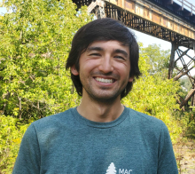
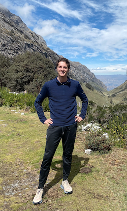
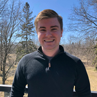

## __Meet Team GIS: _Gauging Impacted Species___

 

#### **Alex Furukawa**
  Alex is in the third year of his Ph.D in Earth and Environmental Science as part of the McMaster Ecohydrology Lab. Alex's research focuses on the hydrological dynamics of peatlands of the Boreal Shield and their implications for resilience to drought and wildfire. He has previously done work on the pore water chemistry of peatlands and geospatial analysis of anthropogenic impacts on coastal wetlands. Alex has long been involved as a Teaching Assistant for McMaster's GIS courses but this is his first App Challenge.
  
  

#### **Henry Gage**
  Henry is a fourth-year student in the Honours Integrated Science program. He is a member of McMaster's Ecohydrology and Glacial Sedimentology Laboratories. Henry's current work examines the impact of road construction on peatland hydrology and species-at-risk habitat. He has also conducted research using remote sensing to examine wildfire in wetlands and the effects of climate change on tropical glaciers in the Peruvian Andes. Henry is a member of McMaster's varsity cross country and track team. This is his first App Challenge! 

  

#### **Daniel Van Veghel**
  Daniel is in the second year of his Masters in Geography, where he conducts travel behaviour-related research out of McMaster's TransLAB (Transportation Research Lab). His current work focuses on investigating and quantifying the impacts of separated cycling infrastructure on bike share ridership in Hamilton, through the use of GIS and GPS data processing. This is Daniel's third App Challenge, and he is so excited to be a part of it again this year! When he isn't working on his research, Daniel is at the rink, curling as part of McMaster's varsity men's curling team. 
