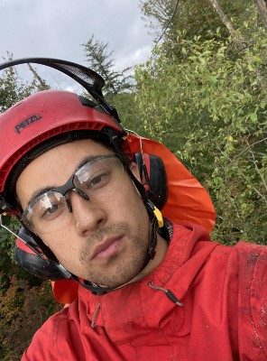
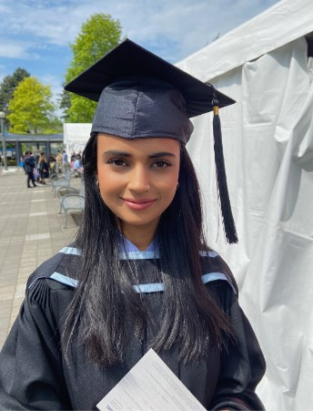
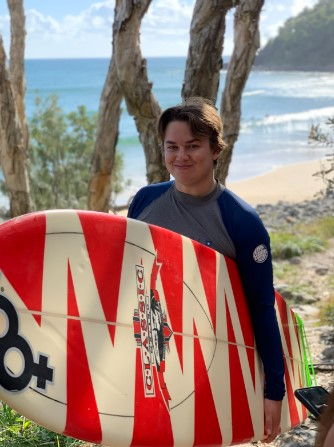

# Team TAM

## Team Member Bios

 **Tyler Kiovsky:** Tyler graduated in 2019 with a T.Diploma in Forestry and Natural Areas Management from British Columbia Institute of Technology. After graduation, Tyler worked in forest management for several years, specializing in operations and layout across the coast of BC. Throughout his time in forestry, he has gained significant experience in forest management and the underlying principles of forest ecology. Tyler has also recently earned the designation of a Certified Arborist under the ISA, and is also eligible to enroll with the Association of BC Forest Professionals. With a slight change of gear, Tyler is now most excited to pursue his interests in GIS. 

 **Anushka Singh:** Anushka Singh graduated in 2022 with a BSc. in Biology from the University of British Columbia. For a year, she worked as an environmental data analyst for UBC’s Sea Around Us gaining experience related fishery data, data reconstruction, literature review, Microsoft Excel and working with government statistics. Anushka’s interest in GIS grew from observing her coworkers using GIS to create maps to represent global fisheries and fish populations. She also has an interest in programming, which is a skill she continues to hone. Upon completing the Advanced Diploma in GIS, her goal is to apply her scientific background, analytical skill and new GIS skills in a field related to epidemiology, ocean health or ecology. 

 **Matt Decoste:** Matt Decoste was born and raised in Hamilton, Ontario. At a young age, Matt discovered his passion for the outdoors whether that was biking, skiing, hiking or camping. He grew up skiing at the small local hill at Blue Mountain. After his first family ski trip to the Interior BC, he made it his life goal to move out to British Columbia to combine my love for the outdoors with my career in GIS! Matt graduated Highschool in 2014 where he then went on to complete his B.A in Geography at York University, graduating in 2019. After discovering his passion in GIS while taking introductory courses at university he decided to pursue a career in the GIS field.In September 2022, Matt continued his studies by taking the Advanced Diploma in GIS at British Columbia Institute of Technology (BCIT). 