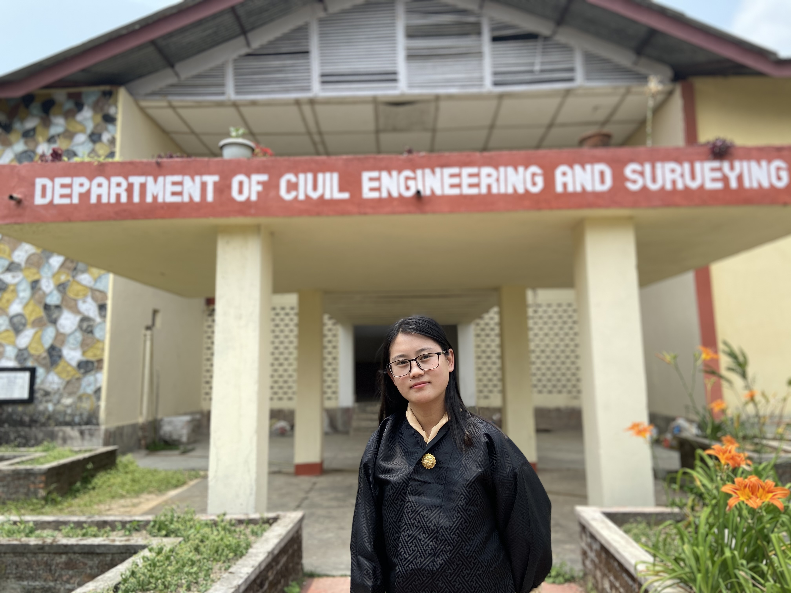
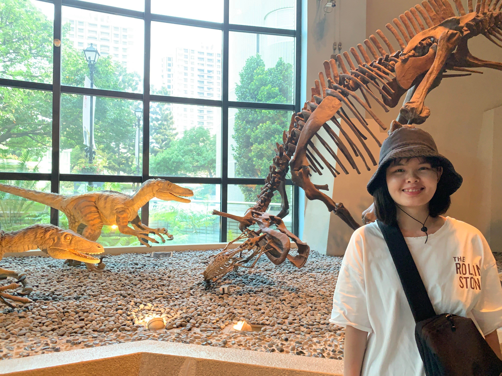

# UNB

## Team Member Bios

 

***Dechen Wangmo:*** Being born in the country driven by the developmental philosophy "Gross National Happiness", which emphasize environmental protection and sustainable development has always intrigued me to learn and understand more about the local environment and its problems that has detrimental effect in the environment. And geodesy and geomatics has been one of the tools needed to provide immediate attention to maintain its sustainability. 

I have graduated from University of Petroleum and Energy Studies, Dehradun, India with Bachelors of Technology in Geo Informatics Engineering. I was working on historical aerial image for the geodesy and geomatics engineering department, UNB. I was working for Royal University of Bhutan before joining University of New Brunswick for pursuing my master’s degree 

 

***Phan Nguyen Hong Ngoc / Jennie Phan:*** Ocean is still a mysterious place to the world. According to NOAA's National Ocean Service, the percentage of global ocean that already is mapped by modern technology is less than 10%. Thus, ocean mappers hold the key to the ocean's problems such as illustrating water depth, shaping seafloor, coastline, and location of underwater obstructions, which are fascinating me for further career.

My passion for Ocean Mapping was highlighted during studying applied Geology. This allowed me to understand that most of the Earth's problems including natural hazards, natural resources, and marine biodiversity stem from the Ocean. Ocean mapping, therefore, plays an important role in exploring ocean resources, navigating ships to decide what and where is safe, and assisting scientists to investigate and protect marine life. I equipped myself with solid knowledge as to geology, field trip activities, laboratory experiments, mathematics (geostatistics, statistics, numerical modeling), GIS techniques, as well as computational programming skills, including Python and R language during my previous study. I wish to enhance my understanding of hydrographic practices, geospatial data analysis, and image interpretation to contribute positive activities to the ocean mapping community.

My educational background includes an Applied Geology Master of Science at the Graduate Institute of Applied Geology, National Central University, Taiwan and currently a Master of Engineering student at the Geodesy and Geomatic Engineering Department, University of New Brunswick, Canada. 
