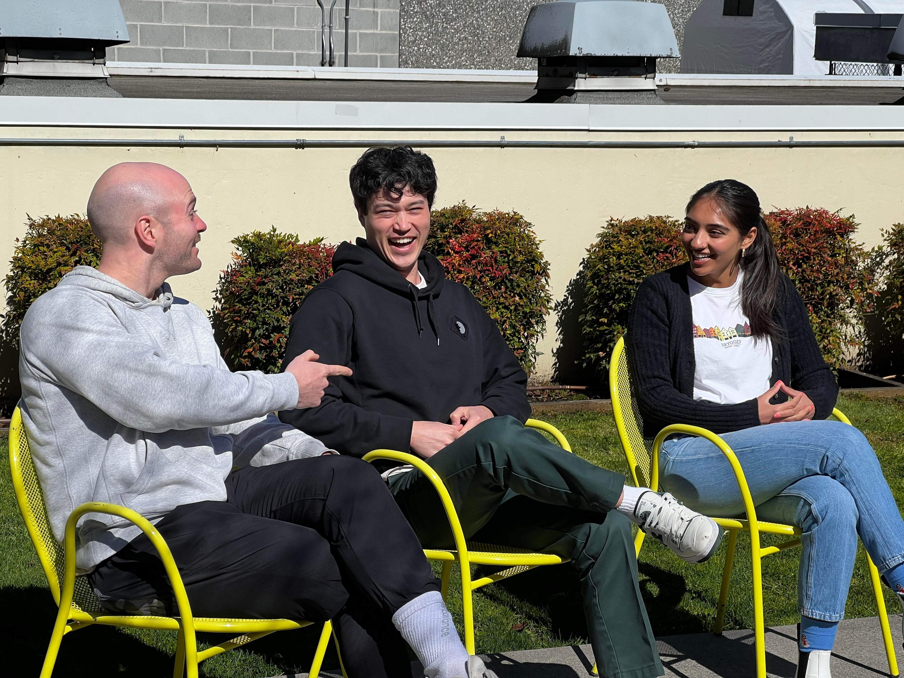

# The Gravy Train
## Team Member Bios

Left to Right: Jordan Lineker, Delphis Lamarche, Ganimul Singh

**Jordan Lineker (he/him):**
Jordan is a born and raised Vancouver Island boy, currently enrolled in BCIT’s Advanced GIS Diploma program. He earned his Bachelor of Arts from Vancouver Island University, majoring in Global Studies, while simultaneously recording and touring with his rock n roll band, The Stacks. After graduating from VIU, he spent several years teaching English in South Korea. Jordan’s looking forward to applying his GIS expertise to the field of Urban Planning. In those rare moments when he isn’t studying, Jordan enjoys hanging out with his dog, exploring the outdoors by foot or by bike, and playing music.

**Delphis Lamarche (he/him):**
Delphis  is a student at BCIT and is taking the Advanced Diploma GIS program. He first graduated with a bachelor's of science in Economics and Environmental Studies at the University of Victoria before attending BCIT. Delphis is especially interested in the use of GIS for natural disaster events, like GeoBC's wildfire dashboard. Outside of school, Delphis likes finding new places to eat delicious food around the Vancouver region, as well as making trips to Vancouver Island to surf. 

**Ganimul Singh (She/Her):**
Ganimul is currently enrolled in the Advanced Diploma program for Geographical Information Systems at BCIT. She graduated from University of British Columbia in 2020 with a degree in Environmental Sciences where she focused her capstone project on outdoor education. Over the years Ganimul has spent her time working for Surrey parks in the outreach division and volunteering at local community gardens. In her spare time she enjoys going to concerts, camping and baking. 
