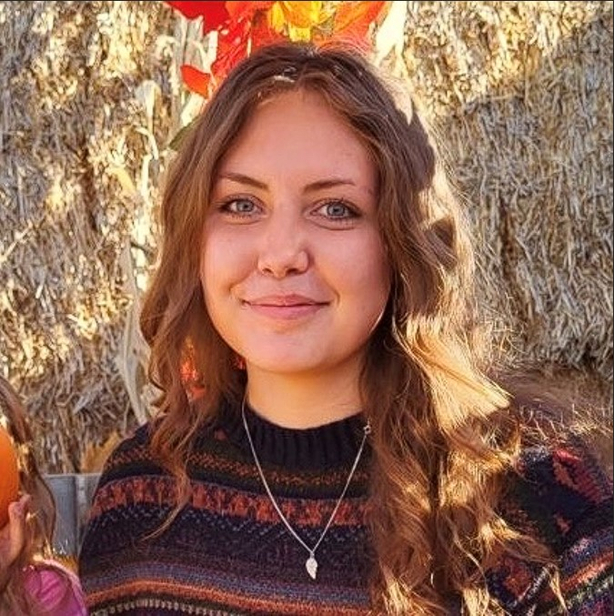
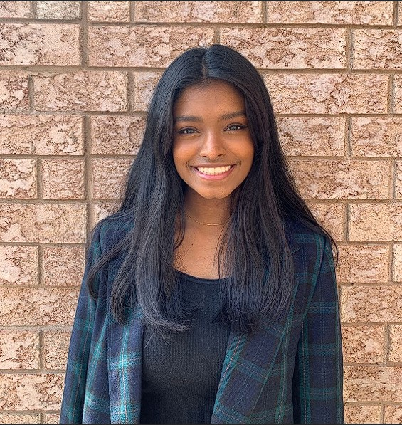
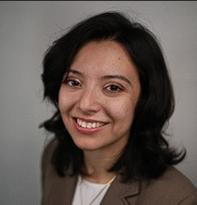

# The Maptivists

## Team Member Bios

 

***Emily Van Loon:*** Hello! I am Emily, a 4B Planning Student at the University of Waterloo specializing in Urban Land Development and GIS. I am passionate about smart city concepts and climate justice, hoping to one day catalyze urban change through GIS technologies. I'm excited to apply my passions for spatial data analysis and urban ecology to this year's challenge! Some of my past notable projects include managing a JavaScript-based spatial data platform and calibrating hydraulic water distribution models. When I'm not creating fantastic GIS applications, I love to read, paint, take care of my plants and spend tons of time outdoors. 

 

***Harane Jegatheswaran:*** Hello, I am Harane! I am a fourth year undergraduate student at the University of Waterloo majoring in Urban Planning and specializing in GIS. My goals in my career involve using my skills to create solutions for aspects of the climate crisis as well plan more sustainable and walkable cities. Some of my projects include developing a robust Carbon Sequestration model as well as design an app to map the spread of wildfire for my previous employer, Korotu Technology Inc. In my free time I enjoy thrifting, reading and trying not to kill my plants. 

 

***Ana-Paula Diaz Garduno:*** Hello, My name is Ana! I am a fourth-year undergraduate student at the University of Waterloo majoring in Geomatics with a minor in Computer Science. Geography has always interested me as a child because of the connections between places. Now, that interest has grown to knowledge and skills to be able to analyze and uncover the connections between spatial data. I developed new editable features on a Mapbox based web application and I have automated data processing scripts for a transportation model. I do recurve archery and I like to read. I currently finished Dune by Frank Herbert. 
