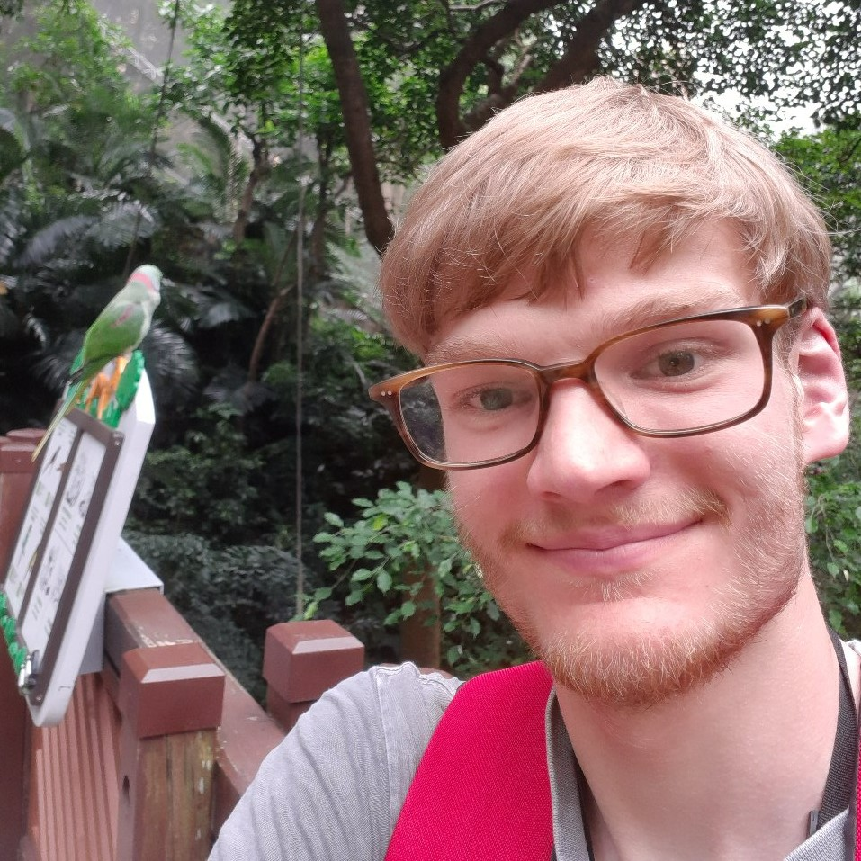

# The Tree-o

## Team Member Bios

 **Ben Woodward:** I am a fourth-year student at the University of Waterloo double-majoring in Geography and Earth Sciences. I am a former gold medalist at the International Geography Olympiad, and I am a fellow of the Royal Canadian Geographical Society. My areas of interest include geography and GIS education, coastal geomorphology, and digital humanities, and I enjoy applying my GIS and web/app development skills to these areas. Some of my projects include www.geoworkshops.ca, a free repository of geography-related workshops and resources for high school students and teachers, and atlas.digitalhistory.ca, a digital atlas that showcases historical photographs, videos, maps, and buildings from across Canada. 
 **Gabriel Diniz:** I am a fourth-year student at the University of Waterloo working towards a Geomatics degree and Computer Science minor. I am currently working part-time at OpenText to help develop Python scripts. I am also working on some personal side projects using Next.js. I am interested in developing useful applications and scripts using coding languages like Python, JavaScript, HTML, CSS, etc. Outside of work and school, I love soccer, games, and going out. Something interesting about me is that I was born and raised in Rio de Janeiro, Brazil! 
 **Paramvir Singh:** I am in my last term of Geomatics at University of Waterloo. I am specializing in Climate change and environment along with a computing minor. I have a keen interest in sustainable housing and green energy. In my free time I love to go out for runs, bike rides and play sports. 