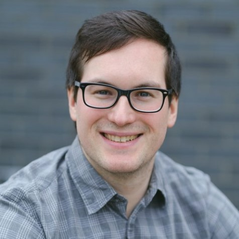

# The Tree Musketeers

## Team Member Bios

 **Alex Patterson:** Alex Patterson graduated from Kwantlen Polytechnic University with a General Studies diploma in August 2021. Her focus began in sustainable landscape design and urban ecosystems in Horticultural Sciences. During her studies, she discovered the versatility of GIS and added Computer Programming in Java, Human Geography, and Introduction to GIS. Upon completion of the Bachelor of Technology in GIS program she will use her existing skills in problem-solving and collaborative teamwork with her acquired analytical skills to provide data-informed solutions to complex problems. Areas of interest include urban and social planning, urban ecosystems, and data analytics. 

 **David Stephen-Tammuz:** David Stephen-Tammuz completed his B.Sc in Earth and Ocean Science from the University of British Columbia in 2016 with a major in Geophysics. He became interested in GIS while working on a mathematical model of rapid urbanization during his degree. Among other positions, David has since worked in shoreline classification for Geographic Emergency Response Planning, where he gained exposure to GISs in an environmental management setting. He is fascinated by GIS’s capacity to bring geographic and demographic data together to solve environmental and social problems. David hopes to apply the skills he gains during the Advanced Diploma to work in urban planning or environmental consulting. 

 **Katie Buell:** Katie is currently working towards completing the GIS Advanced Diploma program at the British Columbia Institute of Technology. She graduated from the University of Victoria in 2020 with a B.Sc. in Earth Science/Biology, and obtained a minor in GIT. After graduation, she went onto work as a LiDAR Technician for a consulting company on Vancouver Island. While working there, she processed electrical transmission line LiDAR data and later became part of the QC team. Her role was to check the quality of processed LiDAR and train employees on how to prepare this data for meeting client standards. Katie is excited to further apply her GIS skills in any future spatial problem she encounters - whether that be in urban planning, wildlife conservation, or mining exploration. 